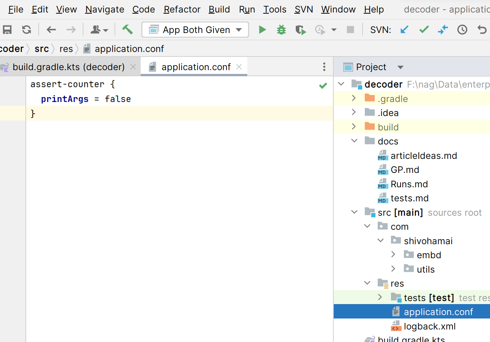

Make these changes to your kotlin script to use this agent

```kotlin
java {
    toolchain {
	languageVersion.set(JavaLanguageVersion.of(21))
    }
}

repositories {
    mavenCentral()
    maven {
	name = "GitHubPackages"
	url = uri("https://maven.pkg.github.com/nagkumar/java")
	credentials {
	    username =
		System.getenv("GITHUB_ACTOR")
		?: "nagkumar"
	    password = System.getenv("GITHUB_TOKEN")
	}
    }
}

dependencies {
    testImplementation("com.shivoham.tools.junit5.agent:asserts-agent:1.0.7-SNAPSHOT") {
	isChanging = true
    }
}

tasks.test {
    jvmArgumentProviders.add(CommandLineArgumentProvider {
	var dd = configurations.testRuntimeClasspath.get().files.find {
	    it.name.contains("asserts-agent")
	}
	listOf("-javaagent:${dd}")
    })
}

//java -javaagent:<pathto local>assert-counter-agent-xxx.jar -jar application-with-tests.jar
```

By default, it displays top summary without details like this

```text
> Task :test

🔧 Test JVM toolchain path: xxx\.jdks\jbr-21.0.7
🧠 Test JVM toolchain vendor: JetBrains
🧠 Java version in toolchain: 21


? AssertCounterAgent activated. Argument printing: false


=== Assert Method Usage Report (Sorted by Package) ===

org.junit.jupiter.api.AssertArrayEquals#assertArrayEquals              : 11
org.junit.jupiter.api.AssertArrayEquals#assertArraysHaveSameLength     : 4
org.junit.jupiter.api.AssertDoesNotThrow#assertDoesNotThrow            : 6
org.junit.jupiter.api.AssertEquals#assertEquals                        : 48
org.junit.jupiter.api.AssertFalse#assertFalse                          : 3
org.junit.jupiter.api.AssertNotNull#assertNotNull                      : 21
org.junit.jupiter.api.AssertNull#assertNull                            : 15
org.junit.jupiter.api.AssertThrows#assertThrows                        : 6
org.junit.jupiter.api.AssertTrue#assertTrue                            : 12
org.junit.jupiter.api.Assertions#assertArrayEquals                     : 4
org.junit.jupiter.api.Assertions#assertDoesNotThrow                    : 3
org.junit.jupiter.api.Assertions#assertEquals                          : 28
org.junit.jupiter.api.Assertions#assertFalse                           : 2
org.junit.jupiter.api.Assertions#assertNotNull                         : 14
org.junit.jupiter.api.Assertions#assertNull                            : 15
org.junit.jupiter.api.Assertions#assertThrows                          : 3
org.junit.jupiter.api.Assertions#assertTrue                            : 10
-------------------------------------------------------
Total assert* method calls: 205
```

if you wish to customise the report then create application.conf and printArgs=true|false


